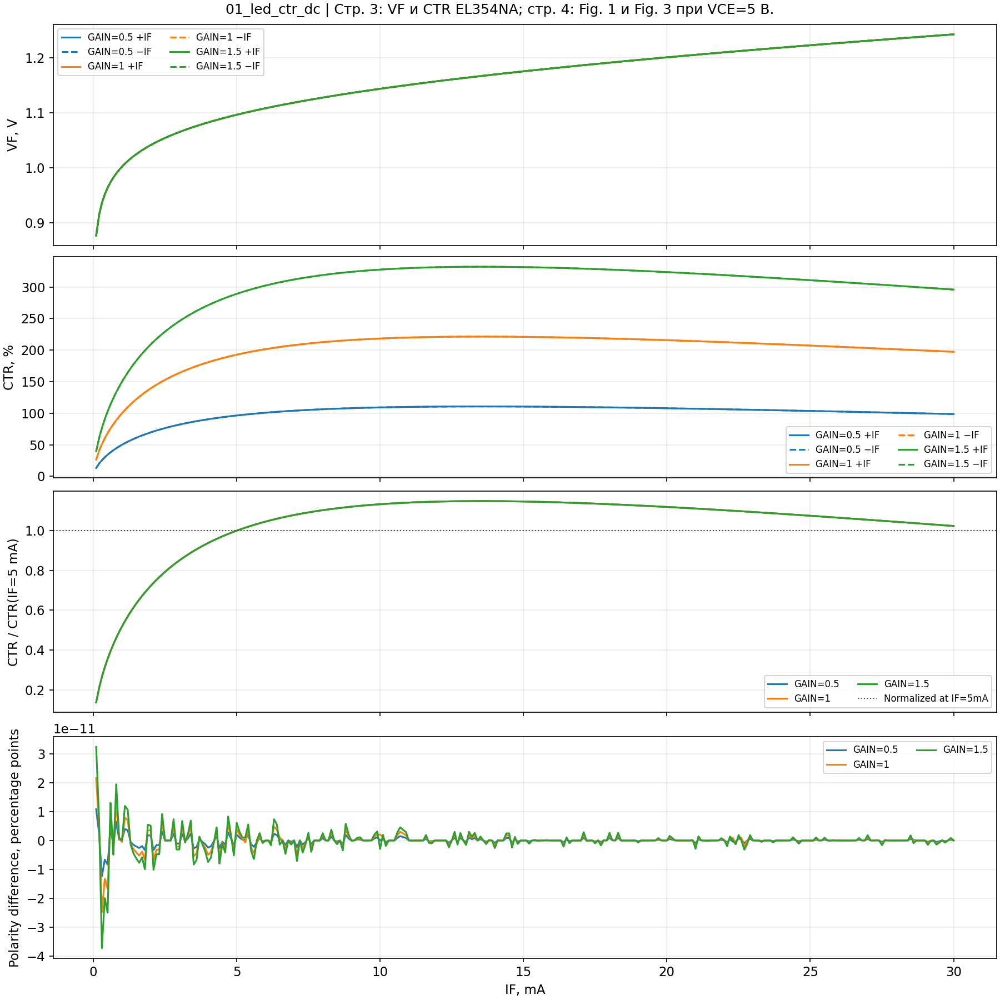
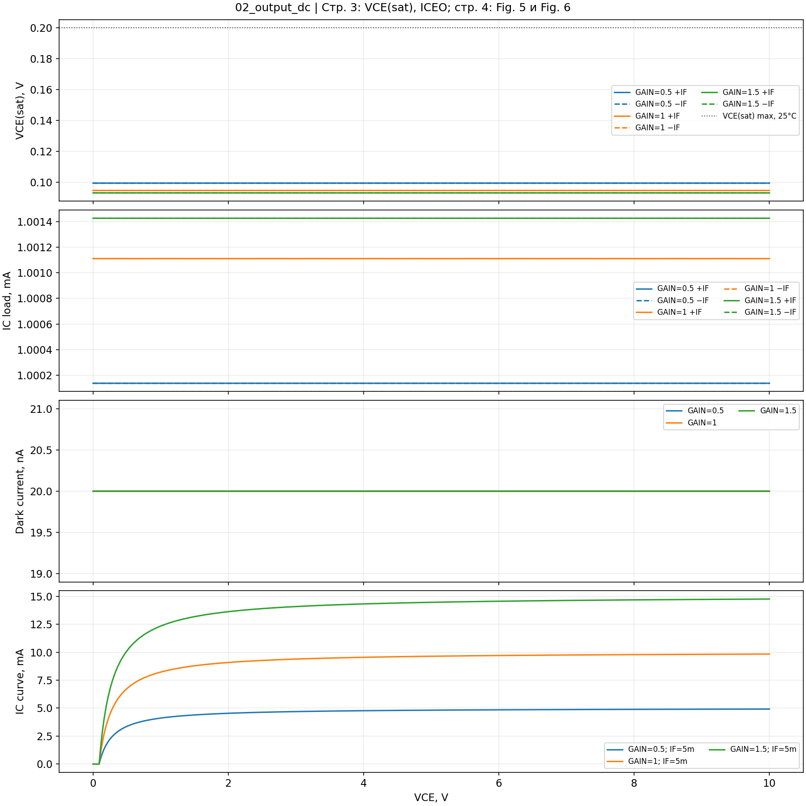
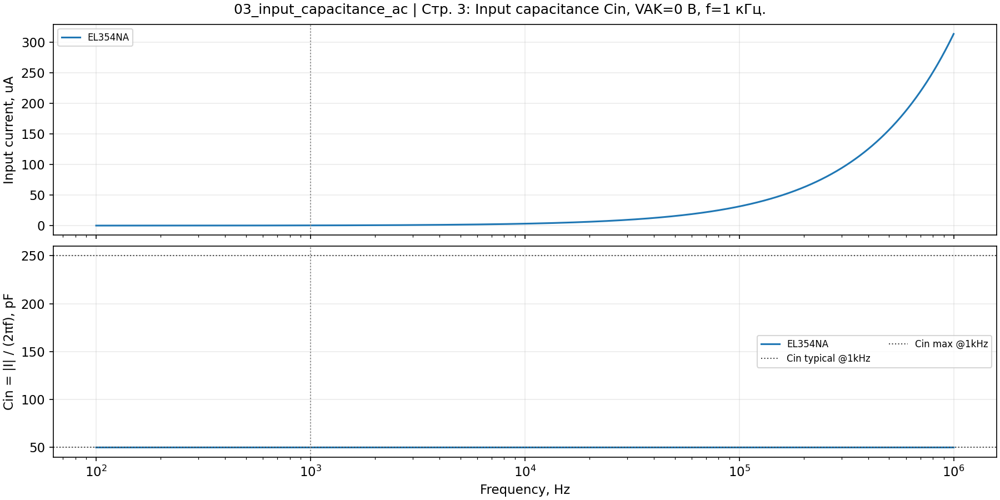
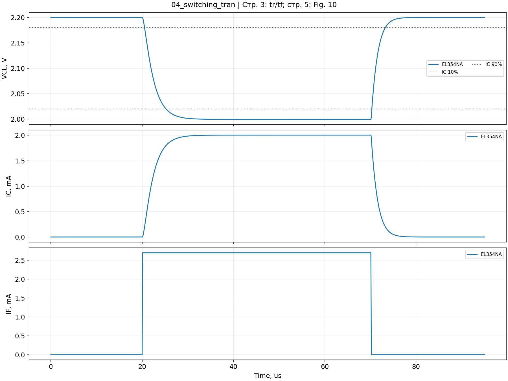
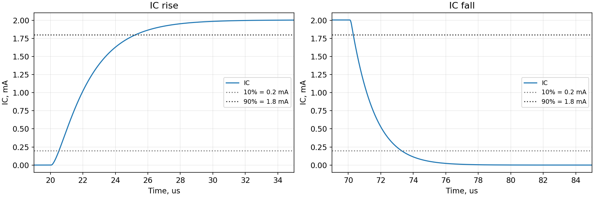
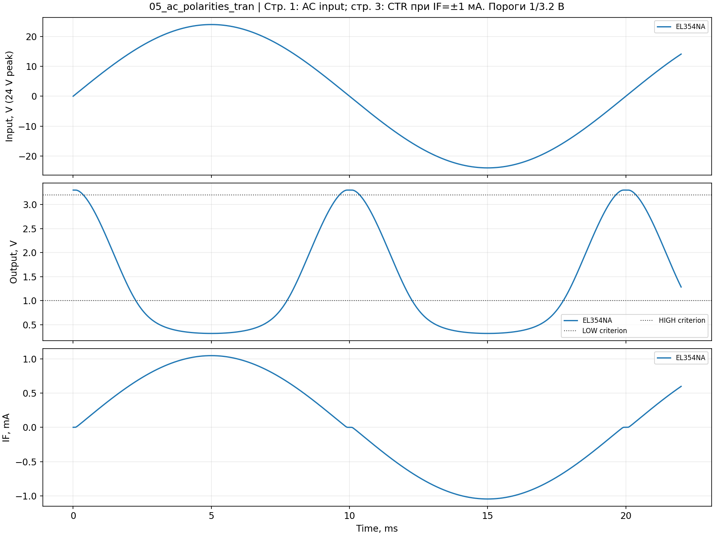
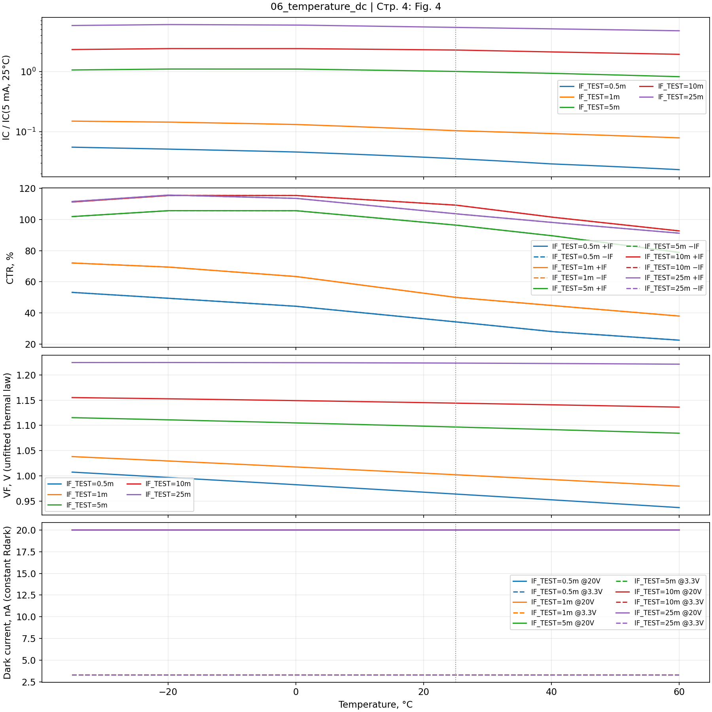

# EL354NA — отчёт автоматической проверки модели

**УСПЕШНО**. Получено измерений: 168. Расчётных случаев: 14.

Дата расчёта UTC: 2026-10-09T11:49:50.364045+00:00. Методика: 1.0.0. Режим: qspice.

Даташит: [EL354N-G Series, Rev.6, 01.09.2016](../../datasheets/EL354N(A)(TA)-VG.pdf). Номера страниц ниже — печатные номера PDF.

PASS — заданный критерий выполнен. WARN — отклонение от типового значения при выполненных предельных критериях. FAIL — критерий не выполнен. ERROR — достоверное измерение или график не получены.

Пределы даташита применяются в указанных изготовителем условиях. Допуски сравнения с типовыми значениями и симметрии задаёт эта методика, они не являются допусками изготовителя. Протокол проверяет модель; применимость реальной оптопары в изделии подтверждается измерениями изделия.

## Сводка

| Случай | Параметры | Результат | Замечание |
|---|---|---|---|
| 01_led_ctr_dc__01 | GAIN=0.5 | PASS |  |
| 01_led_ctr_dc__02 | GAIN=1 | PASS |  |
| 01_led_ctr_dc__03 | GAIN=1.5 | PASS |  |
| 02_output_dc__01 | GAIN=0.5 | PASS |  |
| 02_output_dc__02 | GAIN=1 | PASS |  |
| 02_output_dc__03 | GAIN=1.5 | PASS |  |
| 03_input_capacitance_ac__01 | EL354NA | PASS |  |
| 04_switching_tran__01 | EL354NA | PASS |  |
| 05_ac_polarities_tran__01 | EL354NA | PASS |  |
| 06_temperature_dc__01 | IF_TEST=0.5m | PASS |  |
| 06_temperature_dc__02 | IF_TEST=1m | PASS |  |
| 06_temperature_dc__03 | IF_TEST=5m | PASS |  |
| 06_temperature_dc__04 | IF_TEST=10m | PASS |  |
| 06_temperature_dc__05 | IF_TEST=25m | PASS |  |

## 01_led_ctr_dc — LED и CTR

**С чем сверять:** Стр. 3: VF и CTR EL354NA; стр. 4: Fig. 1 и Fig. 3 при VCE=5 В.

Точек в графическом экспорте: 01_led_ctr_dc__01 — 10001, 01_led_ctr_dc__02 — 10001, 01_led_ctr_dc__03 — 10001.

CTR выводится на графике в процентах; в измерениях — как IC/IF. При IF=±1 мА, VCE=5 В и 25 °C для ранга A диапазон 50…150%. Значения GAIN=0.5/1/1.5 — три заданных варианта модели. Проверка точности заданного GAIN не определяет распределение реальных деталей.

Для Fig. 3 используется CTR(IF)/CTR(5 мА), поэтому сравнивается форма кривой с VCE=5 В. CTR_FIG3_* — дополнительные значения диагностического узла; сами по себе они не нормированы на 5 мА.

### Критерии

| Случай | Измерение | Значение | Единица | Критерий | Основание | Результат |
|---|---|---:|---|---|---|---|
| 01_led_ctr_dc__01 | VF20_TYP | 1.20124 | В | 1.2 ± 0.06 | Типовое значение; допуск методики | PASS |
| 01_led_ctr_dc__01 | VF20_MAX | 1.20124 | В | ≤ 1.4 | Предел даташита, 25 °C | PASS |
| 01_led_ctr_dc__01 | VF20_REV_MAX | 1.20124 | В | ≤ 1.4 | Предел даташита, 25 °C | PASS |
| 01_led_ctr_dc__01 | VF1_DIAGNOSTIC | 1.00238 | В | 1.05 ± 0.15 | Типовое значение; допуск методики | PASS |
| 01_led_ctr_dc__01 | LED_SYM20 | 0 | В | ≤ 0.005 | Согласованность модели | PASS |
| 01_led_ctr_dc__01 | LED_SYM1 | 2.22045e-16 | В | ≤ 0.005 | Согласованность модели | PASS |
| 01_led_ctr_dc__01 | CTR_POS | 0.500005 | 1 (CTR ×100 = %) | 0.5 ± 0.01 | Согласованность модели | PASS |
| 01_led_ctr_dc__01 | CTR_NEG | 0.500005 | 1 (CTR ×100 = %) | 0.5 ± 0.01 | Согласованность модели | PASS |
| 01_led_ctr_dc__01 | CTR_SYM | 1.08052e-13 | 1 (CTR ×100 = %) | ≤ 0.001 | Согласованность модели | PASS |
| 01_led_ctr_dc__02 | VF20_TYP | 1.20124 | В | 1.2 ± 0.06 | Типовое значение; допуск методики | PASS |
| 01_led_ctr_dc__02 | VF20_MAX | 1.20124 | В | ≤ 1.4 | Предел даташита, 25 °C | PASS |
| 01_led_ctr_dc__02 | VF20_REV_MAX | 1.20124 | В | ≤ 1.4 | Предел даташита, 25 °C | PASS |
| 01_led_ctr_dc__02 | VF1_DIAGNOSTIC | 1.00238 | В | 1.05 ± 0.15 | Типовое значение; допуск методики | PASS |
| 01_led_ctr_dc__02 | LED_SYM20 | 0 | В | ≤ 0.005 | Согласованность модели | PASS |
| 01_led_ctr_dc__02 | LED_SYM1 | 2.22045e-16 | В | ≤ 0.005 | Согласованность модели | PASS |
| 01_led_ctr_dc__02 | CTR_POS | 1 | 1 (CTR ×100 = %) | 1 ± 0.01 | Согласованность модели | PASS |
| 01_led_ctr_dc__02 | CTR_NEG | 1 | 1 (CTR ×100 = %) | 1 ± 0.01 | Согласованность модели | PASS |
| 01_led_ctr_dc__02 | CTR_SYM | 2.16105e-13 | 1 (CTR ×100 = %) | ≤ 0.001 | Согласованность модели | PASS |
| 01_led_ctr_dc__03 | VF20_TYP | 1.20124 | В | 1.2 ± 0.06 | Типовое значение; допуск методики | PASS |
| 01_led_ctr_dc__03 | VF20_MAX | 1.20124 | В | ≤ 1.4 | Предел даташита, 25 °C | PASS |
| 01_led_ctr_dc__03 | VF20_REV_MAX | 1.20124 | В | ≤ 1.4 | Предел даташита, 25 °C | PASS |
| 01_led_ctr_dc__03 | VF1_DIAGNOSTIC | 1.00238 | В | 1.05 ± 0.15 | Типовое значение; допуск методики | PASS |
| 01_led_ctr_dc__03 | LED_SYM20 | 0 | В | ≤ 0.005 | Согласованность модели | PASS |
| 01_led_ctr_dc__03 | LED_SYM1 | 2.22045e-16 | В | ≤ 0.005 | Согласованность модели | PASS |
| 01_led_ctr_dc__03 | CTR_POS | 1.5 | 1 (CTR ×100 = %) | 1.5 ± 0.01 | Согласованность модели | PASS |
| 01_led_ctr_dc__03 | CTR_NEG | 1.5 | 1 (CTR ×100 = %) | 1.5 ± 0.01 | Согласованность модели | PASS |
| 01_led_ctr_dc__03 | CTR_SYM | 3.23797e-13 | 1 (CTR ×100 = %) | ≤ 0.001 | Согласованность модели | PASS |

### Все измерения QPOST

| Измерение | Единица | GAIN=0.5 | GAIN=1 | GAIN=1.5 |
|---|---|---:|---:|---:|
| CTR_FIG3_0P5M | 1 (CTR ×100 = %) | 0.343177 | 0.343172 | 0.343171 |
| CTR_FIG3_10M | 1 (CTR ×100 = %) | 1.09226 | 1.09226 | 1.09226 |
| CTR_FIG3_1M | 1 (CTR ×100 = %) | 0.500005 | 0.500002 | 0.500002 |
| CTR_FIG3_20M | 1 (CTR ×100 = %) | 1.07903 | 1.07903 | 1.07903 |
| CTR_FIG3_2M | 1 (CTR ×100 = %) | 0.696498 | 0.696496 | 0.696496 |
| CTR_FIG3_30M | 1 (CTR ×100 = %) | 0.986708 | 0.986708 | 0.986708 |
| CTR_FIG3_5M | 1 (CTR ×100 = %) | 0.964108 | 0.964107 | 0.964107 |
| CTR_NEG | 1 (CTR ×100 = %) | 0.500005 | 1 | 1.5 |
| CTR_POS | 1 (CTR ×100 = %) | 0.500005 | 1 | 1.5 |
| CTR_SYM | 1 (CTR ×100 = %) | 1.08052e-13 | 2.16105e-13 | 3.23797e-13 |
| LED_SYM1 | В | 2.22045e-16 | 2.22045e-16 | 2.22045e-16 |
| LED_SYM20 | В | 0 | 0 | 0 |
| VF1_DIAGNOSTIC | В | 1.00238 | 1.00238 | 1.00238 |
| VF20_MAX | В | 1.20124 | 1.20124 | 1.20124 |
| VF20_REV_MAX | В | 1.20124 | 1.20124 | 1.20124 |
| VF20_TYP | В | 1.20124 | 1.20124 | 1.20124 |

## 02_output_dc — Насыщение и темновой ток

**С чем сверять:** Стр. 3: VCE(sat), ICEO; стр. 4: Fig. 5 и Fig. 6 — форма IC(VCE).

Точек в графическом экспорте: 02_output_dc__01 — 10001, 02_output_dc__02 — 10001, 02_output_dc__03 — 10001.

Ветви насыщения работают при IF=±20 мА и IC≈1 мА. Ветвь утечки: IF=0, VCE=20 В. IC(VCE) снят при IF=5 мА; разные GAIN не заменяют разные IF на Fig. 5/6. Форма выходной кривой — визуальная диагностика модели.

### Критерии

| Случай | Измерение | Значение | Единица | Критерий | Основание | Результат |
|---|---|---:|---|---|---|---|
| 02_output_dc__01 | VCE_SAT | 0.0993212 | В | ≤ 0.2 | Предел даташита, 25 °C | PASS |
| 02_output_dc__01 | VCE_SAT_TYP | 0.0993212 | В | 0.1 ± 0.03 | Типовое значение; допуск методики | PASS |
| 02_output_dc__01 | IC_LOAD | 0.00100014 | А | 0.001 ± 4e-05 | Типовое значение; допуск методики | PASS |
| 02_output_dc__01 | ICEO_20V | 2e-08 | А | ≤ 1e-07 | Предел даташита, 25 °C | PASS |
| 02_output_dc__01 | VCE_SAT_NEG | 0.0993212 | В | ≤ 0.2 | Предел даташита, 25 °C | PASS |
| 02_output_dc__01 | IC_LOAD_NEG | 0.00100014 | А | 0.001 ± 4e-05 | Типовое значение; допуск методики | PASS |
| 02_output_dc__02 | VCE_SAT | 0.094559 | В | ≤ 0.2 | Предел даташита, 25 °C | PASS |
| 02_output_dc__02 | VCE_SAT_TYP | 0.094559 | В | 0.1 ± 0.03 | Типовое значение; допуск методики | PASS |
| 02_output_dc__02 | IC_LOAD | 0.00100111 | А | 0.001 ± 4e-05 | Типовое значение; допуск методики | PASS |
| 02_output_dc__02 | ICEO_20V | 2e-08 | А | ≤ 1e-07 | Предел даташита, 25 °C | PASS |
| 02_output_dc__02 | VCE_SAT_NEG | 0.094559 | В | ≤ 0.2 | Предел даташита, 25 °C | PASS |
| 02_output_dc__02 | IC_LOAD_NEG | 0.00100111 | А | 0.001 ± 4e-05 | Типовое значение; допуск методики | PASS |
| 02_output_dc__03 | VCE_SAT | 0.0930174 | В | ≤ 0.2 | Предел даташита, 25 °C | PASS |
| 02_output_dc__03 | VCE_SAT_TYP | 0.0930174 | В | 0.1 ± 0.03 | Типовое значение; допуск методики | PASS |
| 02_output_dc__03 | IC_LOAD | 0.00100143 | А | 0.001 ± 4e-05 | Типовое значение; допуск методики | PASS |
| 02_output_dc__03 | ICEO_20V | 2e-08 | А | ≤ 1e-07 | Предел даташита, 25 °C | PASS |
| 02_output_dc__03 | VCE_SAT_NEG | 0.0930174 | В | ≤ 0.2 | Предел даташита, 25 °C | PASS |
| 02_output_dc__03 | IC_LOAD_NEG | 0.00100143 | А | 0.001 ± 4e-05 | Типовое значение; допуск методики | PASS |

### Все измерения QPOST

| Измерение | Единица | GAIN=0.5 | GAIN=1 | GAIN=1.5 |
|---|---|---:|---:|---:|
| ICEO_20V | А | 2e-08 | 2e-08 | 2e-08 |
| IC_CURVE_AT_5V | А | 0.00482054 | 0.00964107 | 0.0144616 |
| IC_LOAD | А | 0.00100014 | 0.00100111 | 0.00100143 |
| IC_LOAD_NEG | А | 0.00100014 | 0.00100111 | 0.00100143 |
| VCE_SAT | В | 0.0993212 | 0.094559 | 0.0930174 |
| VCE_SAT_NEG | В | 0.0993212 | 0.094559 | 0.0930174 |
| VCE_SAT_TYP | В | 0.0993212 | 0.094559 | 0.0930174 |

## 03_input_capacitance_ac — Входная ёмкость

**С чем сверять:** Стр. 3: Input capacitance Cin, VAK=0 В, f=1 кГц.

Точек в графическом экспорте: 03_input_capacitance_ac__01 — 10001.

Источник AC=1 В, DC=0 В. Cin=|I(Vac)|/(2πf). Критерий применяется в точке 1 кГц; INPUT_I_MAX также измерен именно при 1 кГц, а не как максимум по частотам. Это входная ёмкость, не ёмкость изоляции CIO.

### Критерии

| Случай | Измерение | Значение | Единица | Критерий | Основание | Результат |
|---|---|---:|---|---|---|---|
| 03_input_capacitance_ac__01 | INPUT_I_1KHZ | 3.13749e-07 | А | 3.14e-07 ± 4e-08 | Типовое значение; допуск методики | PASS |
| 03_input_capacitance_ac__01 | INPUT_I_MAX | 3.13749e-07 | А | ≤ 1.571e-06 | Предел даташита, 25 °C | PASS |
| 03_input_capacitance_ac__01 | CIN_1KHZ_PF | 49.9346 | пФ | ≤ 250 | Предел даташита, 25 °C | PASS |
| 03_input_capacitance_ac__01 | CIN_1KHZ_PF | 49.9346 | пФ | 50 ± 5 | Типовое значение; допуск методики | PASS |

### Все измерения QPOST

| Измерение | Единица | EL354NA |
|---|---|---:|
| CIN_1KHZ_PF | пФ | 49.9346 |
| INPUT_I_1KHZ | А | 3.13749e-07 |
| INPUT_I_MAX | А | 3.13749e-07 |

## 04_switching_tran — Время переключения

**С чем сверять:** Стр. 3: tr/tf; стр. 5: Fig. 10 — определения фронтов и условия VCE=2 В, IC=2 мА, RL=100 Ом.

Точек в графическом экспорте: 04_switching_tran__01 — 10001.

Фронты IC определяются по уровням Vout=2.18/2.02 В: при VCC=2.2 В и RL=100 Ом это IC=0.2/1.8 мА. При IC(on)≈2 мА уровни соответствуют 10/90%. Измеренные интервалы сравниваются с tr/tf≤18 мкс. IF=2.7 мА настроен для этой модели; если установившийся IC существенно отличается от 2 мА, сравнение фиксированных уровней с даташитом теряет смысл.

### Критерии

| Случай | Измерение | Значение | Единица | Критерий | Основание | Результат |
|---|---|---:|---|---|---|---|
| 04_switching_tran__01 | T_RISE_IC | 4.71043e-06 | с | ≤ 1.8e-05 | Предел даташита, 25 °C | PASS |
| 04_switching_tran__01 | T_FALL_IC | 2.95988e-06 | с | ≤ 1.8e-05 | Предел даташита, 25 °C | PASS |
| 04_switching_tran__01 | VCE_ON | 1.9996 | В | 2 ± 0.15 | Типовое значение; допуск методики | PASS |
| 04_switching_tran__01 | IC_ON_DERIVED | 0.002004 | А | 0.002 ± 0.0001 | Согласованность модели | PASS |
| 04_switching_tran__01 | T_RISE_IC | 4.71043e-06 | с | > 0 | Согласованность модели | PASS |
| 04_switching_tran__01 | T_FALL_IC | 2.95988e-06 | с | > 0 | Согласованность модели | PASS |

### Все измерения QPOST

| Измерение | Единица | EL354NA |
|---|---|---:|
| T_FALL_IC | с | 2.95988e-06 |
| T_RISE_IC | с | 4.71043e-06 |
| VCE_ON | В | 1.9996 |

## 05_ac_polarities_tran — Работа на обеих полуволнах

**С чем сверять:** Стр. 1: AC input; стр. 3: CTR при IF=±1 мА. Пороги 1/3.2 В — критерии этой схемы, отдельной строки даташита для них нет.

Точек в графическом экспорте: 05_ac_polarities_tran__01 — 10001.

На входе синус 24 В амплитудой, 50 Гц. V_POS (5 мс) и V_NEG (15 мс) проверяют включение на обеих полуволнах; V_ZERO (10 мс) — отпускание около перехода через ноль. Это функциональный тест с подтяжкой 10 кОм к 3.3 В; пороги 1/3.2 В выбраны для стенда. Проверка отключения фазы и температурная приёмка входа микроконтроллера в этот тест не входят.

### Критерии

| Случай | Измерение | Значение | Единица | Критерий | Основание | Результат |
|---|---|---:|---|---|---|---|
| 05_ac_polarities_tran__01 | V_POS | 0.320545 | В | ≤ 1 | Критерий схемы | PASS |
| 05_ac_polarities_tran__01 | V_ZERO | 3.29996 | В | ≥ 3.2 | Критерий схемы | PASS |
| 05_ac_polarities_tran__01 | V_NEG | 0.320545 | В | ≤ 1 | Критерий схемы | PASS |

### Все измерения QPOST

| Измерение | Единица | EL354NA |
|---|---|---:|
| V_NEG | В | 0.320545 |
| V_POS | В | 0.320545 |
| V_ZERO | В | 3.29996 |

## 06_temperature_dc — Температурные зависимости

**С чем сверять:** Стр. 4: Fig. 4 — normalized IC(T), VCE=5 В; Fig. 1 — VF(T). ICEO≤100 нА на стр. 3 задан только при 25 °C.

Точек в графическом экспорте: 06_temperature_dc__01 — 10001, 06_temperature_dc__02 — 10001, 06_temperature_dc__03 — 10001, 06_temperature_dc__04 — 10001, 06_temperature_dc__05 — 10001.

Реальная температура симулятора меняется от −35 до +60 °C. THERMAL=1, IF=0.5/1/5/10/25 мА, VCE=5 В. На Fig. 4 все кривые IC нормированы на одну опорную точку IC при IF=5 мА и 25 °C. График использует V(ic_norm), а F_T_COLD/HOT показывает изменение каждой кривой относительно её собственной точки при 25 °C.

Поправка CTR(T,IF) — приближённое воспроизведение типовых кривых; гарантированные минимумы CTR во всём температурном диапазоне из неё не следуют. Температурная зависимость VF не подогнана к Fig. 1. Утечка задана постоянным Rdark=1 ГОм: 20 нА при 20 В и 3.3 нА при 3.3 В. Результаты ICEO при +60 °C показывают только эту модель, отдельного допуска даташита для них нет.

### Критерии

| Случай | Измерение | Значение | Единица | Критерий | Основание | Результат |
|---|---|---:|---|---|---|---|
| 06_temperature_dc__01 | ACTUAL_TEMP_MIN | -35 | °C | -35 ± 0.001 | Согласованность модели | PASS |
| 06_temperature_dc__01 | ACTUAL_TEMP_MAX | 60 | °C | 60 ± 0.001 | Согласованность модели | PASS |
| 06_temperature_dc__01 | CTR_SYM | 0 | 1 (CTR ×100 = %) | ≤ 0.001 | Согласованность модели | PASS |
| 06_temperature_dc__01 | ICEO_20V_AT_25 | 2e-08 | А | ≤ 1e-07 | Предел даташита, 25 °C | PASS |
| 06_temperature_dc__01 | CTR_AT_25 | 0.343177 | 1 (CTR ×100 = %) | > 0 (согласованность модели) | Согласованность модели | PASS |
| 06_temperature_dc__01 | CTR_AT_COLD | 0.532096 | 1 (CTR ×100 = %) | > 0 (согласованность модели) | Согласованность модели | PASS |
| 06_temperature_dc__01 | CTR_AT_HOT | 0.225416 | 1 (CTR ×100 = %) | > 0 (согласованность модели) | Согласованность модели | PASS |
| 06_temperature_dc__01 | IC_NORM_AT_25 | 0.0355953 | 1 (CTR ×100 = %) | > 0 (согласованность модели) | Согласованность модели | PASS |
| 06_temperature_dc__01 | VF_AT_COLD | 1.00754 | В | > 0 (согласованность модели) | Согласованность модели | PASS |
| 06_temperature_dc__01 | VF_AT_25 | 0.964158 | В | > 0 (согласованность модели) | Согласованность модели | PASS |
| 06_temperature_dc__01 | VF_AT_HOT | 0.937361 | В | > 0 (согласованность модели) | Согласованность модели | PASS |
| 06_temperature_dc__01 | POLARITY_25 | 0 | 1 (CTR ×100 = %) | ≤ 0.001 | Согласованность модели | PASS |
| 06_temperature_dc__01 | POLARITY_COLD | 0 | 1 (CTR ×100 = %) | ≤ 0.001 | Согласованность модели | PASS |
| 06_temperature_dc__01 | POLARITY_HOT | 0 | 1 (CTR ×100 = %) | ≤ 0.001 | Согласованность модели | PASS |
| 06_temperature_dc__02 | ACTUAL_TEMP_MIN | -35 | °C | -35 ± 0.001 | Согласованность модели | PASS |
| 06_temperature_dc__02 | ACTUAL_TEMP_MAX | 60 | °C | 60 ± 0.001 | Согласованность модели | PASS |
| 06_temperature_dc__02 | CTR_SYM | 0 | 1 (CTR ×100 = %) | ≤ 0.001 | Согласованность модели | PASS |
| 06_temperature_dc__02 | ICEO_20V_AT_25 | 2e-08 | А | ≤ 1e-07 | Предел даташита, 25 °C | PASS |
| 06_temperature_dc__02 | CTR_AT_25 | 0.500005 | 1 (CTR ×100 = %) | > 0 (согласованность модели) | Согласованность модели | PASS |
| 06_temperature_dc__02 | CTR_AT_COLD | 0.720615 | 1 (CTR ×100 = %) | > 0 (согласованность модели) | Согласованность модели | PASS |
| 06_temperature_dc__02 | CTR_AT_HOT | 0.380126 | 1 (CTR ×100 = %) | > 0 (согласованность модели) | Согласованность модели | PASS |
| 06_temperature_dc__02 | IC_NORM_AT_25 | 0.103724 | 1 (CTR ×100 = %) | > 0 (согласованность модели) | Согласованность модели | PASS |
| 06_temperature_dc__02 | VF_AT_COLD | 1.03827 | В | > 0 (согласованность модели) | Согласованность модели | PASS |
| 06_temperature_dc__02 | VF_AT_25 | 1.00238 | В | > 0 (согласованность модели) | Согласованность модели | PASS |
| 06_temperature_dc__02 | VF_AT_HOT | 0.97995 | В | > 0 (согласованность модели) | Согласованность модели | PASS |
| 06_temperature_dc__02 | POLARITY_25 | 0 | 1 (CTR ×100 = %) | ≤ 0.001 | Согласованность модели | PASS |
| 06_temperature_dc__02 | POLARITY_COLD | 0 | 1 (CTR ×100 = %) | ≤ 0.001 | Согласованность модели | PASS |
| 06_temperature_dc__02 | POLARITY_HOT | 0 | 1 (CTR ×100 = %) | ≤ 0.001 | Согласованность модели | PASS |
| 06_temperature_dc__03 | ACTUAL_TEMP_MIN | -35 | °C | -35 ± 0.001 | Согласованность модели | PASS |
| 06_temperature_dc__03 | ACTUAL_TEMP_MAX | 60 | °C | 60 ± 0.001 | Согласованность модели | PASS |
| 06_temperature_dc__03 | CTR_SYM | 0 | 1 (CTR ×100 = %) | ≤ 0.001 | Согласованность модели | PASS |
| 06_temperature_dc__03 | ICEO_20V_AT_25 | 2e-08 | А | ≤ 1e-07 | Предел даташита, 25 °C | PASS |
| 06_temperature_dc__03 | CTR_AT_25 | 0.964108 | 1 (CTR ×100 = %) | > 0 (согласованность модели) | Согласованность модели | PASS |
| 06_temperature_dc__03 | CTR_AT_COLD | 1.01844 | 1 (CTR ×100 = %) | > 0 (согласованность модели) | Согласованность модели | PASS |
| 06_temperature_dc__03 | CTR_AT_HOT | 0.788541 | 1 (CTR ×100 = %) | > 0 (согласованность модели) | Согласованность модели | PASS |
| 06_temperature_dc__03 | IC_NORM_AT_25 | 1 | 1 (CTR ×100 = %) | > 0 (согласованность модели) | Согласованность модели | PASS |
| 06_temperature_dc__03 | VF_AT_COLD | 1.1153 | В | > 0 (согласованность модели) | Согласованность модели | PASS |
| 06_temperature_dc__03 | VF_AT_25 | 1.0968 | В | > 0 (согласованность модели) | Согласованность модели | PASS |
| 06_temperature_dc__03 | VF_AT_HOT | 1.08452 | В | > 0 (согласованность модели) | Согласованность модели | PASS |
| 06_temperature_dc__03 | POLARITY_25 | 0 | 1 (CTR ×100 = %) | ≤ 0.001 | Согласованность модели | PASS |
| 06_temperature_dc__03 | POLARITY_COLD | 0 | 1 (CTR ×100 = %) | ≤ 0.001 | Согласованность модели | PASS |
| 06_temperature_dc__03 | POLARITY_HOT | 0 | 1 (CTR ×100 = %) | ≤ 0.001 | Согласованность модели | PASS |
| 06_temperature_dc__04 | ACTUAL_TEMP_MIN | -35 | °C | -35 ± 0.001 | Согласованность модели | PASS |
| 06_temperature_dc__04 | ACTUAL_TEMP_MAX | 60 | °C | 60 ± 0.001 | Согласованность модели | PASS |
| 06_temperature_dc__04 | CTR_SYM | 0 | 1 (CTR ×100 = %) | ≤ 0.001 | Согласованность модели | PASS |
| 06_temperature_dc__04 | ICEO_20V_AT_25 | 2e-08 | А | ≤ 1e-07 | Предел даташита, 25 °C | PASS |
| 06_temperature_dc__04 | CTR_AT_25 | 1.09226 | 1 (CTR ×100 = %) | > 0 (согласованность модели) | Согласованность модели | PASS |
| 06_temperature_dc__04 | CTR_AT_COLD | 1.1124 | 1 (CTR ×100 = %) | > 0 (согласованность модели) | Согласованность модели | PASS |
| 06_temperature_dc__04 | CTR_AT_HOT | 0.926608 | 1 (CTR ×100 = %) | > 0 (согласованность модели) | Согласованность модели | PASS |
| 06_temperature_dc__04 | IC_NORM_AT_25 | 2.26584 | 1 (CTR ×100 = %) | > 0 (согласованность модели) | Согласованность модели | PASS |
| 06_temperature_dc__04 | VF_AT_COLD | 1.15503 | В | > 0 (согласованность модели) | Согласованность модели | PASS |
| 06_temperature_dc__04 | VF_AT_25 | 1.14402 | В | > 0 (согласованность модели) | Согласованность модели | PASS |
| 06_temperature_dc__04 | VF_AT_HOT | 1.13611 | В | > 0 (согласованность модели) | Согласованность модели | PASS |
| 06_temperature_dc__04 | POLARITY_25 | 0 | 1 (CTR ×100 = %) | ≤ 0.001 | Согласованность модели | PASS |
| 06_temperature_dc__04 | POLARITY_COLD | 0 | 1 (CTR ×100 = %) | ≤ 0.001 | Согласованность модели | PASS |
| 06_temperature_dc__04 | POLARITY_HOT | 0 | 1 (CTR ×100 = %) | ≤ 0.001 | Согласованность модели | PASS |
| 06_temperature_dc__05 | ACTUAL_TEMP_MIN | -35 | °C | -35 ± 0.001 | Согласованность модели | PASS |
| 06_temperature_dc__05 | ACTUAL_TEMP_MAX | 60 | °C | 60 ± 0.001 | Согласованность модели | PASS |
| 06_temperature_dc__05 | CTR_SYM | 0 | 1 (CTR ×100 = %) | ≤ 0.001 | Согласованность модели | PASS |
| 06_temperature_dc__05 | ICEO_20V_AT_25 | 2e-08 | А | ≤ 1e-07 | Предел даташита, 25 °C | PASS |
| 06_temperature_dc__05 | CTR_AT_25 | 1.03635 | 1 (CTR ×100 = %) | > 0 (согласованность модели) | Согласованность модели | PASS |
| 06_temperature_dc__05 | CTR_AT_COLD | 1.11494 | 1 (CTR ×100 = %) | > 0 (согласованность модели) | Согласованность модели | PASS |
| 06_temperature_dc__05 | CTR_AT_HOT | 0.911905 | 1 (CTR ×100 = %) | > 0 (согласованность модели) | Согласованность модели | PASS |
| 06_temperature_dc__05 | IC_NORM_AT_25 | 5.37464 | 1 (CTR ×100 = %) | > 0 (согласованность модели) | Согласованность модели | PASS |
| 06_temperature_dc__05 | VF_AT_COLD | 1.22433 | В | > 0 (согласованность модели) | Согласованность модели | PASS |
| 06_temperature_dc__05 | VF_AT_25 | 1.22322 | В | > 0 (согласованность модели) | Согласованность модели | PASS |
| 06_temperature_dc__05 | VF_AT_HOT | 1.22109 | В | > 0 (согласованность модели) | Согласованность модели | PASS |
| 06_temperature_dc__05 | POLARITY_25 | 0 | 1 (CTR ×100 = %) | ≤ 0.001 | Согласованность модели | PASS |
| 06_temperature_dc__05 | POLARITY_COLD | 0 | 1 (CTR ×100 = %) | ≤ 0.001 | Согласованность модели | PASS |
| 06_temperature_dc__05 | POLARITY_HOT | 0 | 1 (CTR ×100 = %) | ≤ 0.001 | Согласованность модели | PASS |

### Все измерения QPOST

| Измерение | Единица | IF_TEST=0.5m | IF_TEST=1m | IF_TEST=5m | IF_TEST=10m | IF_TEST=25m |
|---|---|---:|---:|---:|---:|---:|
| ACTUAL_TEMP_MAX | °C | 60 | 60 | 60 | 60 | 60 |
| ACTUAL_TEMP_MIN | °C | -35 | -35 | -35 | -35 | -35 |
| CTR_AT_25 | 1 (CTR ×100 = %) | 0.343177 | 0.500005 | 0.964108 | 1.09226 | 1.03635 |
| CTR_AT_COLD | 1 (CTR ×100 = %) | 0.532096 | 0.720615 | 1.01844 | 1.1124 | 1.11494 |
| CTR_AT_HOT | 1 (CTR ×100 = %) | 0.225416 | 0.380126 | 0.788541 | 0.926608 | 0.911905 |
| CTR_NEG_AT_25 | 1 (CTR ×100 = %) | 0.343177 | 0.500005 | 0.964108 | 1.09226 | 1.03635 |
| CTR_NEG_AT_COLD | 1 (CTR ×100 = %) | 0.532096 | 0.720615 | 1.01844 | 1.1124 | 1.11494 |
| CTR_NEG_AT_HOT | 1 (CTR ×100 = %) | 0.225416 | 0.380126 | 0.788541 | 0.926608 | 0.911905 |
| CTR_SYM | 1 (CTR ×100 = %) | 0 | 0 | 0 | 0 | 0 |
| F_T_COLD | 1 (CTR ×100 = %) | 1.5505 | 1.44122 | 1.05635 | 1.01844 | 1.07584 |
| F_T_HOT | 1 (CTR ×100 = %) | 0.656851 | 0.760245 | 0.817897 | 0.848343 | 0.879923 |
| ICEO_20V_AT_25 | А | 2e-08 | 2e-08 | 2e-08 | 2e-08 | 2e-08 |
| ICEO_20V_AT_60 | А | 2e-08 | 2e-08 | 2e-08 | 2e-08 | 2e-08 |
| ICEO_3V3_AT_60 | А | 3.3e-09 | 3.3e-09 | 3.3e-09 | 3.3e-09 | 3.3e-09 |
| IC_NORM_AT_25 | 1 (CTR ×100 = %) | 0.0355953 | 0.103724 | 1 | 2.26584 | 5.37464 |
| VF_AT_25 | В | 0.964158 | 1.00238 | 1.0968 | 1.14402 | 1.22322 |
| VF_AT_COLD | В | 1.00754 | 1.03827 | 1.1153 | 1.15503 | 1.22433 |
| VF_AT_HOT | В | 0.937361 | 0.97995 | 1.08452 | 1.13611 | 1.22109 |

## Воспроизводимость

Измерения получены QPOST по полному QRAW. Для рисунков используется экспорт QUX в CSV: запрошено 10000 интервалов на случай; фактическое число точек указано в разделе стенда. Сглаживание matplotlib не применяется. .step развёрнут в отдельные расчёты с теми же значениями параметров. Нетлист создаётся из QSCH; подключённая модель включается в расчётный CIR без изменения исходных файлов.

| Исходный файл | SHA-256 |
|---|---|
| EL354NA.txt | `311db5844bf4908947b427fdde5e735d741a61786c0c693550e3c7e621d64ff9` |
| datasheets/EL354N(A)(TA)-VG.pdf | `c89a81da051800a1b2832dc35ef7f9bd9cbac01f1dafb10b47554e5af79355d5` |
| run_suite.py | `9b55e08f0ac0422d3648cd1a02b85b5822c1ae73c5dd01a12b2c201becf23112` |
| tests.json | `bb69eb7f9b2d400a794beeb098979593e641af6363bed4462fc17a9ffe503c29` |
| tests/01_led_ctr_dc.qsch | `26ca1efcf523d157456a790a0bfc8dbc1e420f5a3152ccf675da6d00ac320827` |
| tests/02_output_dc.qsch | `e3af5a4bb5c8de7cefaa406ed52cdc8351466912ee3d393691ebafe3387b91e7` |
| tests/03_input_capacitance_ac.qsch | `3ece117f3d5f5febe98b4c15a15582086a2b70d915a70a4aaea5f371be87f06c` |
| tests/04_switching_tran.qsch | `f95f84b9c4d2ee249d3191c0221cfc052237c816db2f3e1600c5051b26ef2781` |
| tests/05_ac_polarities_tran.qsch | `f2e48ddc45885a652e91593ce19dd286ef1143db6fdd8ee2a604d3b7ccf19144` |
| tests/06_temperature_dc.qsch | `e04e1cbc2c2f90e83d0a70d5b33b33b4195dfb160f064098c812895a932424f4` |

Инструменты QSPICE:

| Файл | SHA-256 |
|---|---|
| QPOST.exe | `d7320bf1c1a4e481b0bbcc3cb9bf25d8658a6f5dcd652b3c0bd5ba9902df45cd` |
| QSPICE64.exe | `240a5308c48c52727b21cf4fc9630bd3100e255e7713c7d4dd6d463245db9a84` |
| QUX.exe | `69abac698f772510ddfc48108ca0c413418ea67f638027c7bb8bf3ade0068fa6` |

Python: 3.14.8. matplotlib: 3.10.8.

Модель не проверяет электрический пробой, изоляцию, саморазогрев, старение и температурную зависимость времени переключения. Эти характеристики требуют отдельных моделей и испытаний.

При успешной обработке всего выбранного набора расчётные файлы удаляются. При FAIL/ERROR сохраняются все полученные QRAW и диагностические файлы; collect_diagnostics.cmd собирает небольшой архив без QRAW и паролей.

<!-- EL354NA_RUN_DATA
{"created_utc": "2026-10-09T11:49:50.364045+00:00", "mode": "qspice", "config": {"suite_version": "1.0.0", "component": "EL354NA", "datasheet": "datasheets/EL354N(A)(TA)-VG.pdf", "timeout_seconds": 300, "export_intervals": 10000, "benches": [{"id": "01_led_ctr_dc", "name": "LED \u0438 CTR", "schematic": "tests/01_led_ctr_dc.qsch", "analysis": "dc", "sweep": {"parameter": "GAIN", "values": ["0.5", "1", "1.5"]}, "probes": ["V(led_pos)", "V(led_neg)", "V(ctr_pos)", "V(ctr_neg)", "V(ctr_sym)"], "axis": {"label": "IF, mA", "scale": 1000, "range": [0.0001, 0.03], "log": false}, "datasheet": "\u0421\u0442\u0440. 3: VF \u0438 CTR EL354NA; \u0441\u0442\u0440. 4: Fig. 1 \u0438 Fig. 3 \u043f\u0440\u0438 VCE=5 \u0412.", "rules": [{"metric": "VF20_TYP", "mode": "warn_abs", "expected": ["1.2"], "tolerance": "0.06", "basis": "typical"}, {"metric": "VF20_MAX", "mode": "max", "expected": ["1.4"], "tolerance": "0", "basis": "limit"}, {"metric": "VF20_REV_MAX", "mode": "max", "expected": ["1.4"], "tolerance": "0", "basis": "limit"}, {"metric": "VF1_DIAGNOSTIC", "mode": "warn_abs", "expected": ["1.05"], "tolerance": "0.15", "basis": "typical"}, {"metric": "LED_SYM20", "mode": "max", "expected": ["0.005"], "tolerance": "0", "basis": "model"}, {"metric": "LED_SYM1", "mode": "max", "expected": ["0.005"], "tolerance": "0", "basis": "model"}, {"metric": "CTR_POS", "mode": "abs", "expected": ["0.5", "1", "1.5"], "tolerance": "0.01", "basis": "model"}, {"metric": "CTR_NEG", "mode": "abs", "expected": ["0.5", "1", "1.5"], "tolerance": "0.01", "basis": "model"}, {"metric": "CTR_SYM", "mode": "max", "expected": ["0.001"], "tolerance": "0", "basis": "model"}]}, {"id": "02_output_dc", "name": "\u041d\u0430\u0441\u044b\u0449\u0435\u043d\u0438\u0435 \u0438 \u0442\u0435\u043c\u043d\u043e\u0432\u043e\u0439 \u0442\u043e\u043a", "schematic": "tests/02_output_dc.qsch", "analysis": "dc", "sweep": {"parameter": "GAIN", "values": ["0.5", "1", "1.5"]}, "probes": ["V(csat_pos)", "V(csat_neg)", "-I(Rpos)", "-I(Rneg)", "V(darkmon)", "-I(Vce_curve)"], "axis": {"label": "VCE, V", "scale": 1, "range": [0, 10], "log": false}, "datasheet": "\u0421\u0442\u0440. 3: VCE(sat), ICEO; \u0441\u0442\u0440. 4: Fig. 5 \u0438 Fig. 6 \u2014 \u0444\u043e\u0440\u043c\u0430 IC(VCE).", "rules": [{"metric": "VCE_SAT", "mode": "max", "expected": ["0.2"], "tolerance": "0", "basis": "limit"}, {"metric": "VCE_SAT_TYP", "mode": "warn_abs", "expected": ["0.1"], "tolerance": "0.03", "basis": "typical"}, {"metric": "IC_LOAD", "mode": "warn_abs", "expected": ["1m"], "tolerance": "0.04m", "basis": "typical"}, {"metric": "ICEO_20V", "mode": "max", "expected": ["100n"], "tolerance": "0", "basis": "limit"}, {"metric": "VCE_SAT_NEG", "mode": "max", "expected": "0.2", "tolerance": "0", "basis": "limit"}, {"metric": "IC_LOAD_NEG", "mode": "warn_abs", "expected": "1m", "tolerance": "0.04m", "basis": "typical"}]}, {"id": "03_input_capacitance_ac", "name": "\u0412\u0445\u043e\u0434\u043d\u0430\u044f \u0451\u043c\u043a\u043e\u0441\u0442\u044c", "schematic": "tests/03_input_capacitance_ac.qsch", "analysis": "ac", "sweep": null, "probes": ["abs(I(Vac))"], "axis": {"label": "Frequency, Hz", "scale": 1, "range": [100, 1000000.0], "log": true}, "datasheet": "\u0421\u0442\u0440. 3: Input capacitance Cin, VAK=0 \u0412, f=1 \u043a\u0413\u0446.", "rules": [{"metric": "INPUT_I_1KHZ", "mode": "warn_abs", "expected": ["314n"], "tolerance": "40n", "basis": "typical"}, {"metric": "INPUT_I_MAX", "mode": "max", "expected": ["1.571u"], "tolerance": "0", "basis": "limit"}, {"metric": "CIN_1KHZ_PF", "mode": "max", "expected": "250", "tolerance": "0", "basis": "limit"}, {"metric": "CIN_1KHZ_PF", "mode": "warn_abs", "expected": "50", "tolerance": "5", "basis": "typical"}]}, {"id": "04_switching_tran", "name": "\u0412\u0440\u0435\u043c\u044f \u043f\u0435\u0440\u0435\u043a\u043b\u044e\u0447\u0435\u043d\u0438\u044f", "schematic": "tests/04_switching_tran.qsch", "analysis": "tran", "sweep": null, "probes": ["V(out)", "-I(Vload)", "I(Viled)"], "axis": {"label": "Time, us", "scale": 1000000.0, "range": [0, 9.5e-05], "log": false}, "datasheet": "\u0421\u0442\u0440. 3: tr/tf; \u0441\u0442\u0440. 5: Fig. 10 \u2014 \u043e\u043f\u0440\u0435\u0434\u0435\u043b\u0435\u043d\u0438\u044f \u0444\u0440\u043e\u043d\u0442\u043e\u0432 \u0438 \u0443\u0441\u043b\u043e\u0432\u0438\u044f VCE=2 \u0412, IC=2 \u043c\u0410, RL=100 \u041e\u043c.", "rules": [{"metric": "T_RISE_IC", "mode": "max", "expected": ["18u"], "tolerance": "0", "basis": "limit"}, {"metric": "T_FALL_IC", "mode": "max", "expected": ["18u"], "tolerance": "0", "basis": "limit"}, {"metric": "VCE_ON", "mode": "warn_abs", "expected": ["2"], "tolerance": "0.15", "basis": "typical"}]}, {"id": "05_ac_polarities_tran", "name": "\u0420\u0430\u0431\u043e\u0442\u0430 \u043d\u0430 \u043e\u0431\u0435\u0438\u0445 \u043f\u043e\u043b\u0443\u0432\u043e\u043b\u043d\u0430\u0445", "schematic": "tests/05_ac_polarities_tran.qsch", "analysis": "tran", "sweep": null, "probes": ["V(line)", "V(out)", "I(Viled)"], "axis": {"label": "Time, ms", "scale": 1000, "range": [0, 0.022], "log": false}, "datasheet": "\u0421\u0442\u0440. 1: AC input; \u0441\u0442\u0440. 3: CTR \u043f\u0440\u0438 IF=\u00b11 \u043c\u0410. \u041f\u043e\u0440\u043e\u0433\u0438 1/3.2 \u0412 \u2014 \u043a\u0440\u0438\u0442\u0435\u0440\u0438\u0438 \u044d\u0442\u043e\u0439 \u0441\u0445\u0435\u043c\u044b, \u043e\u0442\u0434\u0435\u043b\u044c\u043d\u043e\u0439 \u0441\u0442\u0440\u043e\u043a\u0438 \u0434\u0430\u0442\u0430\u0448\u0438\u0442\u0430 \u0434\u043b\u044f \u043d\u0438\u0445 \u043d\u0435\u0442.", "rules": [{"metric": "V_POS", "mode": "max", "expected": ["1"], "tolerance": "0", "basis": "circuit"}, {"metric": "V_ZERO", "mode": "min", "expected": ["3.2"], "tolerance": "0", "basis": "circuit"}, {"metric": "V_NEG", "mode": "max", "expected": ["1"], "tolerance": "0", "basis": "circuit"}]}, {"id": "06_temperature_dc", "name": "\u0422\u0435\u043c\u043f\u0435\u0440\u0430\u0442\u0443\u0440\u043d\u044b\u0435 \u0437\u0430\u0432\u0438\u0441\u0438\u043c\u043e\u0441\u0442\u0438", "schematic": "tests/06_temperature_dc.qsch", "analysis": "dc", "sweep": {"parameter": "IF_TEST", "values": ["0.5m", "1m", "5m", "10m", "25m"]}, "probes": ["V(ctr_pos)", "V(ctr_neg)", "V(ctr_sym)", "V(ic_norm)", "V(led_pos)", "V(idark20)", "V(idark3)", "V(actual_temp)"], "axis": {"label": "Temperature, \u00b0C", "scale": 1, "range": [-35, 60], "log": false}, "datasheet": "\u0421\u0442\u0440. 4: Fig. 4 \u2014 normalized IC(T), VCE=5 \u0412; Fig. 1 \u2014 VF(T). ICEO\u2264100 \u043d\u0410 \u043d\u0430 \u0441\u0442\u0440. 3 \u0437\u0430\u0434\u0430\u043d \u0442\u043e\u043b\u044c\u043a\u043e \u043f\u0440\u0438 25 \u00b0C.", "rules": [{"metric": "ACTUAL_TEMP_MIN", "mode": "abs", "expected": "-35", "tolerance": "0.001", "basis": "model"}, {"metric": "ACTUAL_TEMP_MAX", "mode": "abs", "expected": "60", "tolerance": "0.001", "basis": "model"}, {"metric": "CTR_SYM", "mode": "max", "expected": "0.001", "tolerance": "0", "basis": "model"}, {"metric": "ICEO_20V_AT_25", "mode": "max", "expected": "100n", "tolerance": "0", "basis": "limit"}]}]}, "cases": [{"id": "01_led_ctr_dc__01", "bench": "01_led_ctr_dc", "index": 0, "parameters": {"GAIN": "0.5"}, "status": "PASS", "measurements": {"CTR_POS": 0.500005, "CTR_NEG": 0.500005, "CTR_SYM": 1.08052e-13, "VF20_TYP": 1.20124, "VF20_MAX": 1.20124, "VF20_REV_MAX": 1.20124, "VF1_DIAGNOSTIC": 1.00238, "LED_SYM20": 0.0, "LED_SYM1": 2.22045e-16, "CTR_FIG3_0P5M": 0.343177, "CTR_FIG3_1M": 0.500005, "CTR_FIG3_2M": 0.696498, "CTR_FIG3_5M": 0.964108, "CTR_FIG3_10M": 1.09226, "CTR_FIG3_20M": 1.07903, "CTR_FIG3_30M": 0.986708}, "waveform_points": 10001, "checks": [{"metric": "VF20_TYP", "value": 1.20124, "criterion": "1.2 \u00b1 0.06", "basis": "typical", "status": "PASS"}, {"metric": "VF20_MAX", "value": 1.20124, "criterion": "\u2264 1.4", "basis": "limit", "status": "PASS"}, {"metric": "VF20_REV_MAX", "value": 1.20124, "criterion": "\u2264 1.4", "basis": "limit", "status": "PASS"}, {"metric": "VF1_DIAGNOSTIC", "value": 1.00238, "criterion": "1.05 \u00b1 0.15", "basis": "typical", "status": "PASS"}, {"metric": "LED_SYM20", "value": 0.0, "criterion": "\u2264 0.005", "basis": "model", "status": "PASS"}, {"metric": "LED_SYM1", "value": 2.22045e-16, "criterion": "\u2264 0.005", "basis": "model", "status": "PASS"}, {"metric": "CTR_POS", "value": 0.500005, "criterion": "0.5 \u00b1 0.01", "basis": "model", "status": "PASS"}, {"metric": "CTR_NEG", "value": 0.500005, "criterion": "0.5 \u00b1 0.01", "basis": "model", "status": "PASS"}, {"metric": "CTR_SYM", "value": 1.08052e-13, "criterion": "\u2264 0.001", "basis": "model", "status": "PASS"}]}, {"id": "01_led_ctr_dc__02", "bench": "01_led_ctr_dc", "index": 1, "parameters": {"GAIN": "1"}, "status": "PASS", "measurements": {"CTR_POS": 1.0, "CTR_NEG": 1.0, "CTR_SYM": 2.16105e-13, "VF20_TYP": 1.20124, "VF20_MAX": 1.20124, "VF20_REV_MAX": 1.20124, "VF1_DIAGNOSTIC": 1.00238, "LED_SYM20": 0.0, "LED_SYM1": 2.22045e-16, "CTR_FIG3_0P5M": 0.343172, "CTR_FIG3_1M": 0.500002, "CTR_FIG3_2M": 0.696496, "CTR_FIG3_5M": 0.964107, "CTR_FIG3_10M": 1.09226, "CTR_FIG3_20M": 1.07903, "CTR_FIG3_30M": 0.986708}, "waveform_points": 10001, "checks": [{"metric": "VF20_TYP", "value": 1.20124, "criterion": "1.2 \u00b1 0.06", "basis": "typical", "status": "PASS"}, {"metric": "VF20_MAX", "value": 1.20124, "criterion": "\u2264 1.4", "basis": "limit", "status": "PASS"}, {"metric": "VF20_REV_MAX", "value": 1.20124, "criterion": "\u2264 1.4", "basis": "limit", "status": "PASS"}, {"metric": "VF1_DIAGNOSTIC", "value": 1.00238, "criterion": "1.05 \u00b1 0.15", "basis": "typical", "status": "PASS"}, {"metric": "LED_SYM20", "value": 0.0, "criterion": "\u2264 0.005", "basis": "model", "status": "PASS"}, {"metric": "LED_SYM1", "value": 2.22045e-16, "criterion": "\u2264 0.005", "basis": "model", "status": "PASS"}, {"metric": "CTR_POS", "value": 1.0, "criterion": "1 \u00b1 0.01", "basis": "model", "status": "PASS"}, {"metric": "CTR_NEG", "value": 1.0, "criterion": "1 \u00b1 0.01", "basis": "model", "status": "PASS"}, {"metric": "CTR_SYM", "value": 2.16105e-13, "criterion": "\u2264 0.001", "basis": "model", "status": "PASS"}]}, {"id": "01_led_ctr_dc__03", "bench": "01_led_ctr_dc", "index": 2, "parameters": {"GAIN": "1.5"}, "status": "PASS", "measurements": {"CTR_POS": 1.5, "CTR_NEG": 1.5, "CTR_SYM": 3.23797e-13, "VF20_TYP": 1.20124, "VF20_MAX": 1.20124, "VF20_REV_MAX": 1.20124, "VF1_DIAGNOSTIC": 1.00238, "LED_SYM20": 0.0, "LED_SYM1": 2.22045e-16, "CTR_FIG3_0P5M": 0.343171, "CTR_FIG3_1M": 0.500002, "CTR_FIG3_2M": 0.696496, "CTR_FIG3_5M": 0.964107, "CTR_FIG3_10M": 1.09226, "CTR_FIG3_20M": 1.07903, "CTR_FIG3_30M": 0.986708}, "waveform_points": 10001, "checks": [{"metric": "VF20_TYP", "value": 1.20124, "criterion": "1.2 \u00b1 0.06", "basis": "typical", "status": "PASS"}, {"metric": "VF20_MAX", "value": 1.20124, "criterion": "\u2264 1.4", "basis": "limit", "status": "PASS"}, {"metric": "VF20_REV_MAX", "value": 1.20124, "criterion": "\u2264 1.4", "basis": "limit", "status": "PASS"}, {"metric": "VF1_DIAGNOSTIC", "value": 1.00238, "criterion": "1.05 \u00b1 0.15", "basis": "typical", "status": "PASS"}, {"metric": "LED_SYM20", "value": 0.0, "criterion": "\u2264 0.005", "basis": "model", "status": "PASS"}, {"metric": "LED_SYM1", "value": 2.22045e-16, "criterion": "\u2264 0.005", "basis": "model", "status": "PASS"}, {"metric": "CTR_POS", "value": 1.5, "criterion": "1.5 \u00b1 0.01", "basis": "model", "status": "PASS"}, {"metric": "CTR_NEG", "value": 1.5, "criterion": "1.5 \u00b1 0.01", "basis": "model", "status": "PASS"}, {"metric": "CTR_SYM", "value": 3.23797e-13, "criterion": "\u2264 0.001", "basis": "model", "status": "PASS"}]}, {"id": "02_output_dc__01", "bench": "02_output_dc", "index": 0, "parameters": {"GAIN": "0.5"}, "status": "PASS", "measurements": {"VCE_SAT": 0.0993212, "VCE_SAT_TYP": 0.0993212, "IC_LOAD": 0.00100014, "ICEO_20V": 2e-08, "VCE_SAT_NEG": 0.0993212, "IC_LOAD_NEG": 0.00100014, "IC_CURVE_AT_5V": 0.00482054}, "waveform_points": 10001, "checks": [{"metric": "VCE_SAT", "value": 0.0993212, "criterion": "\u2264 0.2", "basis": "limit", "status": "PASS"}, {"metric": "VCE_SAT_TYP", "value": 0.0993212, "criterion": "0.1 \u00b1 0.03", "basis": "typical", "status": "PASS"}, {"metric": "IC_LOAD", "value": 0.00100014, "criterion": "0.001 \u00b1 4e-05", "basis": "typical", "status": "PASS"}, {"metric": "ICEO_20V", "value": 2e-08, "criterion": "\u2264 1e-07", "basis": "limit", "status": "PASS"}, {"metric": "VCE_SAT_NEG", "value": 0.0993212, "criterion": "\u2264 0.2", "basis": "limit", "status": "PASS"}, {"metric": "IC_LOAD_NEG", "value": 0.00100014, "criterion": "0.001 \u00b1 4e-05", "basis": "typical", "status": "PASS"}]}, {"id": "02_output_dc__02", "bench": "02_output_dc", "index": 1, "parameters": {"GAIN": "1"}, "status": "PASS", "measurements": {"VCE_SAT": 0.094559, "VCE_SAT_TYP": 0.094559, "IC_LOAD": 0.00100111, "ICEO_20V": 2e-08, "VCE_SAT_NEG": 0.094559, "IC_LOAD_NEG": 0.00100111, "IC_CURVE_AT_5V": 0.00964107}, "waveform_points": 10001, "checks": [{"metric": "VCE_SAT", "value": 0.094559, "criterion": "\u2264 0.2", "basis": "limit", "status": "PASS"}, {"metric": "VCE_SAT_TYP", "value": 0.094559, "criterion": "0.1 \u00b1 0.03", "basis": "typical", "status": "PASS"}, {"metric": "IC_LOAD", "value": 0.00100111, "criterion": "0.001 \u00b1 4e-05", "basis": "typical", "status": "PASS"}, {"metric": "ICEO_20V", "value": 2e-08, "criterion": "\u2264 1e-07", "basis": "limit", "status": "PASS"}, {"metric": "VCE_SAT_NEG", "value": 0.094559, "criterion": "\u2264 0.2", "basis": "limit", "status": "PASS"}, {"metric": "IC_LOAD_NEG", "value": 0.00100111, "criterion": "0.001 \u00b1 4e-05", "basis": "typical", "status": "PASS"}]}, {"id": "02_output_dc__03", "bench": "02_output_dc", "index": 2, "parameters": {"GAIN": "1.5"}, "status": "PASS", "measurements": {"VCE_SAT": 0.0930174, "VCE_SAT_TYP": 0.0930174, "IC_LOAD": 0.00100143, "ICEO_20V": 2e-08, "VCE_SAT_NEG": 0.0930174, "IC_LOAD_NEG": 0.00100143, "IC_CURVE_AT_5V": 0.0144616}, "waveform_points": 10001, "checks": [{"metric": "VCE_SAT", "value": 0.0930174, "criterion": "\u2264 0.2", "basis": "limit", "status": "PASS"}, {"metric": "VCE_SAT_TYP", "value": 0.0930174, "criterion": "0.1 \u00b1 0.03", "basis": "typical", "status": "PASS"}, {"metric": "IC_LOAD", "value": 0.00100143, "criterion": "0.001 \u00b1 4e-05", "basis": "typical", "status": "PASS"}, {"metric": "ICEO_20V", "value": 2e-08, "criterion": "\u2264 1e-07", "basis": "limit", "status": "PASS"}, {"metric": "VCE_SAT_NEG", "value": 0.0930174, "criterion": "\u2264 0.2", "basis": "limit", "status": "PASS"}, {"metric": "IC_LOAD_NEG", "value": 0.00100143, "criterion": "0.001 \u00b1 4e-05", "basis": "typical", "status": "PASS"}]}, {"id": "03_input_capacitance_ac__01", "bench": "03_input_capacitance_ac", "index": 0, "parameters": {}, "status": "PASS", "measurements": {"INPUT_I_1KHZ": 3.13749e-07, "INPUT_I_MAX": 3.13749e-07, "CIN_1KHZ_PF": 49.9346}, "waveform_points": 10001, "checks": [{"metric": "INPUT_I_1KHZ", "value": 3.13749e-07, "criterion": "3.14e-07 \u00b1 4e-08", "basis": "typical", "status": "PASS"}, {"metric": "INPUT_I_MAX", "value": 3.13749e-07, "criterion": "\u2264 1.571e-06", "basis": "limit", "status": "PASS"}, {"metric": "CIN_1KHZ_PF", "value": 49.9346, "criterion": "\u2264 250", "basis": "limit", "status": "PASS"}, {"metric": "CIN_1KHZ_PF", "value": 49.9346, "criterion": "50 \u00b1 5", "basis": "typical", "status": "PASS"}]}, {"id": "04_switching_tran__01", "bench": "04_switching_tran", "index": 0, "parameters": {}, "status": "PASS", "measurements": {"VCE_ON": 1.9996, "T_RISE_IC": 4.71043e-06, "T_FALL_IC": 2.95988e-06}, "waveform_points": 10001, "checks": [{"metric": "T_RISE_IC", "value": 4.71043e-06, "criterion": "\u2264 1.8e-05", "basis": "limit", "status": "PASS"}, {"metric": "T_FALL_IC", "value": 2.95988e-06, "criterion": "\u2264 1.8e-05", "basis": "limit", "status": "PASS"}, {"metric": "VCE_ON", "value": 1.9996, "criterion": "2 \u00b1 0.15", "basis": "typical", "status": "PASS"}, {"metric": "IC_ON_DERIVED", "value": 0.0020040000000000014, "criterion": "0.002 \u00b1 0.0001", "basis": "model", "status": "PASS"}, {"metric": "T_RISE_IC", "value": 4.71043e-06, "criterion": "> 0", "basis": "model", "status": "PASS"}, {"metric": "T_FALL_IC", "value": 2.95988e-06, "criterion": "> 0", "basis": "model", "status": "PASS"}]}, {"id": "05_ac_polarities_tran__01", "bench": "05_ac_polarities_tran", "index": 0, "parameters": {}, "status": "PASS", "measurements": {"V_POS": 0.320545, "V_ZERO": 3.29996, "V_NEG": 0.320545}, "waveform_points": 10001, "checks": [{"metric": "V_POS", "value": 0.320545, "criterion": "\u2264 1", "basis": "circuit", "status": "PASS"}, {"metric": "V_ZERO", "value": 3.29996, "criterion": "\u2265 3.2", "basis": "circuit", "status": "PASS"}, {"metric": "V_NEG", "value": 0.320545, "criterion": "\u2264 1", "basis": "circuit", "status": "PASS"}]}, {"id": "06_temperature_dc__01", "bench": "06_temperature_dc", "index": 0, "parameters": {"IF_TEST": "0.5m"}, "status": "PASS", "measurements": {"ACTUAL_TEMP_MIN": -35.0, "ACTUAL_TEMP_MAX": 60.0, "CTR_AT_25": 0.343177, "CTR_AT_COLD": 0.532096, "CTR_AT_HOT": 0.225416, "CTR_NEG_AT_25": 0.343177, "CTR_NEG_AT_COLD": 0.532096, "CTR_NEG_AT_HOT": 0.225416, "CTR_SYM": 0.0, "F_T_COLD": 1.5505, "F_T_HOT": 0.656851, "IC_NORM_AT_25": 0.0355953, "VF_AT_COLD": 1.00754, "VF_AT_25": 0.964158, "VF_AT_HOT": 0.937361, "ICEO_20V_AT_25": 2e-08, "ICEO_20V_AT_60": 2e-08, "ICEO_3V3_AT_60": 3.3e-09}, "waveform_points": 10001, "checks": [{"metric": "ACTUAL_TEMP_MIN", "value": -35.0, "criterion": "-35 \u00b1 0.001", "basis": "model", "status": "PASS"}, {"metric": "ACTUAL_TEMP_MAX", "value": 60.0, "criterion": "60 \u00b1 0.001", "basis": "model", "status": "PASS"}, {"metric": "CTR_SYM", "value": 0.0, "criterion": "\u2264 0.001", "basis": "model", "status": "PASS"}, {"metric": "ICEO_20V_AT_25", "value": 2e-08, "criterion": "\u2264 1e-07", "basis": "limit", "status": "PASS"}, {"metric": "CTR_AT_25", "value": 0.343177, "criterion": "> 0 (\u0441\u043e\u0433\u043b\u0430\u0441\u043e\u0432\u0430\u043d\u043d\u043e\u0441\u0442\u044c \u043c\u043e\u0434\u0435\u043b\u0438)", "basis": "model", "status": "PASS"}, {"metric": "CTR_AT_COLD", "value": 0.532096, "criterion": "> 0 (\u0441\u043e\u0433\u043b\u0430\u0441\u043e\u0432\u0430\u043d\u043d\u043e\u0441\u0442\u044c \u043c\u043e\u0434\u0435\u043b\u0438)", "basis": "model", "status": "PASS"}, {"metric": "CTR_AT_HOT", "value": 0.225416, "criterion": "> 0 (\u0441\u043e\u0433\u043b\u0430\u0441\u043e\u0432\u0430\u043d\u043d\u043e\u0441\u0442\u044c \u043c\u043e\u0434\u0435\u043b\u0438)", "basis": "model", "status": "PASS"}, {"metric": "IC_NORM_AT_25", "value": 0.0355953, "criterion": "> 0 (\u0441\u043e\u0433\u043b\u0430\u0441\u043e\u0432\u0430\u043d\u043d\u043e\u0441\u0442\u044c \u043c\u043e\u0434\u0435\u043b\u0438)", "basis": "model", "status": "PASS"}, {"metric": "VF_AT_COLD", "value": 1.00754, "criterion": "> 0 (\u0441\u043e\u0433\u043b\u0430\u0441\u043e\u0432\u0430\u043d\u043d\u043e\u0441\u0442\u044c \u043c\u043e\u0434\u0435\u043b\u0438)", "basis": "model", "status": "PASS"}, {"metric": "VF_AT_25", "value": 0.964158, "criterion": "> 0 (\u0441\u043e\u0433\u043b\u0430\u0441\u043e\u0432\u0430\u043d\u043d\u043e\u0441\u0442\u044c \u043c\u043e\u0434\u0435\u043b\u0438)", "basis": "model", "status": "PASS"}, {"metric": "VF_AT_HOT", "value": 0.937361, "criterion": "> 0 (\u0441\u043e\u0433\u043b\u0430\u0441\u043e\u0432\u0430\u043d\u043d\u043e\u0441\u0442\u044c \u043c\u043e\u0434\u0435\u043b\u0438)", "basis": "model", "status": "PASS"}, {"metric": "POLARITY_25", "value": 0.0, "criterion": "\u2264 0.001", "basis": "model", "status": "PASS"}, {"metric": "POLARITY_COLD", "value": 0.0, "criterion": "\u2264 0.001", "basis": "model", "status": "PASS"}, {"metric": "POLARITY_HOT", "value": 0.0, "criterion": "\u2264 0.001", "basis": "model", "status": "PASS"}]}, {"id": "06_temperature_dc__02", "bench": "06_temperature_dc", "index": 1, "parameters": {"IF_TEST": "1m"}, "status": "PASS", "measurements": {"ACTUAL_TEMP_MIN": -35.0, "ACTUAL_TEMP_MAX": 60.0, "CTR_AT_25": 0.500005, "CTR_AT_COLD": 0.720615, "CTR_AT_HOT": 0.380126, "CTR_NEG_AT_25": 0.500005, "CTR_NEG_AT_COLD": 0.720615, "CTR_NEG_AT_HOT": 0.380126, "CTR_SYM": 0.0, "F_T_COLD": 1.44122, "F_T_HOT": 0.760245, "IC_NORM_AT_25": 0.103724, "VF_AT_COLD": 1.03827, "VF_AT_25": 1.00238, "VF_AT_HOT": 0.97995, "ICEO_20V_AT_25": 2e-08, "ICEO_20V_AT_60": 2e-08, "ICEO_3V3_AT_60": 3.3e-09}, "waveform_points": 10001, "checks": [{"metric": "ACTUAL_TEMP_MIN", "value": -35.0, "criterion": "-35 \u00b1 0.001", "basis": "model", "status": "PASS"}, {"metric": "ACTUAL_TEMP_MAX", "value": 60.0, "criterion": "60 \u00b1 0.001", "basis": "model", "status": "PASS"}, {"metric": "CTR_SYM", "value": 0.0, "criterion": "\u2264 0.001", "basis": "model", "status": "PASS"}, {"metric": "ICEO_20V_AT_25", "value": 2e-08, "criterion": "\u2264 1e-07", "basis": "limit", "status": "PASS"}, {"metric": "CTR_AT_25", "value": 0.500005, "criterion": "> 0 (\u0441\u043e\u0433\u043b\u0430\u0441\u043e\u0432\u0430\u043d\u043d\u043e\u0441\u0442\u044c \u043c\u043e\u0434\u0435\u043b\u0438)", "basis": "model", "status": "PASS"}, {"metric": "CTR_AT_COLD", "value": 0.720615, "criterion": "> 0 (\u0441\u043e\u0433\u043b\u0430\u0441\u043e\u0432\u0430\u043d\u043d\u043e\u0441\u0442\u044c \u043c\u043e\u0434\u0435\u043b\u0438)", "basis": "model", "status": "PASS"}, {"metric": "CTR_AT_HOT", "value": 0.380126, "criterion": "> 0 (\u0441\u043e\u0433\u043b\u0430\u0441\u043e\u0432\u0430\u043d\u043d\u043e\u0441\u0442\u044c \u043c\u043e\u0434\u0435\u043b\u0438)", "basis": "model", "status": "PASS"}, {"metric": "IC_NORM_AT_25", "value": 0.103724, "criterion": "> 0 (\u0441\u043e\u0433\u043b\u0430\u0441\u043e\u0432\u0430\u043d\u043d\u043e\u0441\u0442\u044c \u043c\u043e\u0434\u0435\u043b\u0438)", "basis": "model", "status": "PASS"}, {"metric": "VF_AT_COLD", "value": 1.03827, "criterion": "> 0 (\u0441\u043e\u0433\u043b\u0430\u0441\u043e\u0432\u0430\u043d\u043d\u043e\u0441\u0442\u044c \u043c\u043e\u0434\u0435\u043b\u0438)", "basis": "model", "status": "PASS"}, {"metric": "VF_AT_25", "value": 1.00238, "criterion": "> 0 (\u0441\u043e\u0433\u043b\u0430\u0441\u043e\u0432\u0430\u043d\u043d\u043e\u0441\u0442\u044c \u043c\u043e\u0434\u0435\u043b\u0438)", "basis": "model", "status": "PASS"}, {"metric": "VF_AT_HOT", "value": 0.97995, "criterion": "> 0 (\u0441\u043e\u0433\u043b\u0430\u0441\u043e\u0432\u0430\u043d\u043d\u043e\u0441\u0442\u044c \u043c\u043e\u0434\u0435\u043b\u0438)", "basis": "model", "status": "PASS"}, {"metric": "POLARITY_25", "value": 0.0, "criterion": "\u2264 0.001", "basis": "model", "status": "PASS"}, {"metric": "POLARITY_COLD", "value": 0.0, "criterion": "\u2264 0.001", "basis": "model", "status": "PASS"}, {"metric": "POLARITY_HOT", "value": 0.0, "criterion": "\u2264 0.001", "basis": "model", "status": "PASS"}]}, {"id": "06_temperature_dc__03", "bench": "06_temperature_dc", "index": 2, "parameters": {"IF_TEST": "5m"}, "status": "PASS", "measurements": {"ACTUAL_TEMP_MIN": -35.0, "ACTUAL_TEMP_MAX": 60.0, "CTR_AT_25": 0.964108, "CTR_AT_COLD": 1.01844, "CTR_AT_HOT": 0.788541, "CTR_NEG_AT_25": 0.964108, "CTR_NEG_AT_COLD": 1.01844, "CTR_NEG_AT_HOT": 0.788541, "CTR_SYM": 0.0, "F_T_COLD": 1.05635, "F_T_HOT": 0.817897, "IC_NORM_AT_25": 1.0, "VF_AT_COLD": 1.1153, "VF_AT_25": 1.0968, "VF_AT_HOT": 1.08452, "ICEO_20V_AT_25": 2e-08, "ICEO_20V_AT_60": 2e-08, "ICEO_3V3_AT_60": 3.3e-09}, "waveform_points": 10001, "checks": [{"metric": "ACTUAL_TEMP_MIN", "value": -35.0, "criterion": "-35 \u00b1 0.001", "basis": "model", "status": "PASS"}, {"metric": "ACTUAL_TEMP_MAX", "value": 60.0, "criterion": "60 \u00b1 0.001", "basis": "model", "status": "PASS"}, {"metric": "CTR_SYM", "value": 0.0, "criterion": "\u2264 0.001", "basis": "model", "status": "PASS"}, {"metric": "ICEO_20V_AT_25", "value": 2e-08, "criterion": "\u2264 1e-07", "basis": "limit", "status": "PASS"}, {"metric": "CTR_AT_25", "value": 0.964108, "criterion": "> 0 (\u0441\u043e\u0433\u043b\u0430\u0441\u043e\u0432\u0430\u043d\u043d\u043e\u0441\u0442\u044c \u043c\u043e\u0434\u0435\u043b\u0438)", "basis": "model", "status": "PASS"}, {"metric": "CTR_AT_COLD", "value": 1.01844, "criterion": "> 0 (\u0441\u043e\u0433\u043b\u0430\u0441\u043e\u0432\u0430\u043d\u043d\u043e\u0441\u0442\u044c \u043c\u043e\u0434\u0435\u043b\u0438)", "basis": "model", "status": "PASS"}, {"metric": "CTR_AT_HOT", "value": 0.788541, "criterion": "> 0 (\u0441\u043e\u0433\u043b\u0430\u0441\u043e\u0432\u0430\u043d\u043d\u043e\u0441\u0442\u044c \u043c\u043e\u0434\u0435\u043b\u0438)", "basis": "model", "status": "PASS"}, {"metric": "IC_NORM_AT_25", "value": 1.0, "criterion": "> 0 (\u0441\u043e\u0433\u043b\u0430\u0441\u043e\u0432\u0430\u043d\u043d\u043e\u0441\u0442\u044c \u043c\u043e\u0434\u0435\u043b\u0438)", "basis": "model", "status": "PASS"}, {"metric": "VF_AT_COLD", "value": 1.1153, "criterion": "> 0 (\u0441\u043e\u0433\u043b\u0430\u0441\u043e\u0432\u0430\u043d\u043d\u043e\u0441\u0442\u044c \u043c\u043e\u0434\u0435\u043b\u0438)", "basis": "model", "status": "PASS"}, {"metric": "VF_AT_25", "value": 1.0968, "criterion": "> 0 (\u0441\u043e\u0433\u043b\u0430\u0441\u043e\u0432\u0430\u043d\u043d\u043e\u0441\u0442\u044c \u043c\u043e\u0434\u0435\u043b\u0438)", "basis": "model", "status": "PASS"}, {"metric": "VF_AT_HOT", "value": 1.08452, "criterion": "> 0 (\u0441\u043e\u0433\u043b\u0430\u0441\u043e\u0432\u0430\u043d\u043d\u043e\u0441\u0442\u044c \u043c\u043e\u0434\u0435\u043b\u0438)", "basis": "model", "status": "PASS"}, {"metric": "POLARITY_25", "value": 0.0, "criterion": "\u2264 0.001", "basis": "model", "status": "PASS"}, {"metric": "POLARITY_COLD", "value": 0.0, "criterion": "\u2264 0.001", "basis": "model", "status": "PASS"}, {"metric": "POLARITY_HOT", "value": 0.0, "criterion": "\u2264 0.001", "basis": "model", "status": "PASS"}]}, {"id": "06_temperature_dc__04", "bench": "06_temperature_dc", "index": 3, "parameters": {"IF_TEST": "10m"}, "status": "PASS", "measurements": {"ACTUAL_TEMP_MIN": -35.0, "ACTUAL_TEMP_MAX": 60.0, "CTR_AT_25": 1.09226, "CTR_AT_COLD": 1.1124, "CTR_AT_HOT": 0.926608, "CTR_NEG_AT_25": 1.09226, "CTR_NEG_AT_COLD": 1.1124, "CTR_NEG_AT_HOT": 0.926608, "CTR_SYM": 0.0, "F_T_COLD": 1.01844, "F_T_HOT": 0.848343, "IC_NORM_AT_25": 2.26584, "VF_AT_COLD": 1.15503, "VF_AT_25": 1.14402, "VF_AT_HOT": 1.13611, "ICEO_20V_AT_25": 2e-08, "ICEO_20V_AT_60": 2e-08, "ICEO_3V3_AT_60": 3.3e-09}, "waveform_points": 10001, "checks": [{"metric": "ACTUAL_TEMP_MIN", "value": -35.0, "criterion": "-35 \u00b1 0.001", "basis": "model", "status": "PASS"}, {"metric": "ACTUAL_TEMP_MAX", "value": 60.0, "criterion": "60 \u00b1 0.001", "basis": "model", "status": "PASS"}, {"metric": "CTR_SYM", "value": 0.0, "criterion": "\u2264 0.001", "basis": "model", "status": "PASS"}, {"metric": "ICEO_20V_AT_25", "value": 2e-08, "criterion": "\u2264 1e-07", "basis": "limit", "status": "PASS"}, {"metric": "CTR_AT_25", "value": 1.09226, "criterion": "> 0 (\u0441\u043e\u0433\u043b\u0430\u0441\u043e\u0432\u0430\u043d\u043d\u043e\u0441\u0442\u044c \u043c\u043e\u0434\u0435\u043b\u0438)", "basis": "model", "status": "PASS"}, {"metric": "CTR_AT_COLD", "value": 1.1124, "criterion": "> 0 (\u0441\u043e\u0433\u043b\u0430\u0441\u043e\u0432\u0430\u043d\u043d\u043e\u0441\u0442\u044c \u043c\u043e\u0434\u0435\u043b\u0438)", "basis": "model", "status": "PASS"}, {"metric": "CTR_AT_HOT", "value": 0.926608, "criterion": "> 0 (\u0441\u043e\u0433\u043b\u0430\u0441\u043e\u0432\u0430\u043d\u043d\u043e\u0441\u0442\u044c \u043c\u043e\u0434\u0435\u043b\u0438)", "basis": "model", "status": "PASS"}, {"metric": "IC_NORM_AT_25", "value": 2.26584, "criterion": "> 0 (\u0441\u043e\u0433\u043b\u0430\u0441\u043e\u0432\u0430\u043d\u043d\u043e\u0441\u0442\u044c \u043c\u043e\u0434\u0435\u043b\u0438)", "basis": "model", "status": "PASS"}, {"metric": "VF_AT_COLD", "value": 1.15503, "criterion": "> 0 (\u0441\u043e\u0433\u043b\u0430\u0441\u043e\u0432\u0430\u043d\u043d\u043e\u0441\u0442\u044c \u043c\u043e\u0434\u0435\u043b\u0438)", "basis": "model", "status": "PASS"}, {"metric": "VF_AT_25", "value": 1.14402, "criterion": "> 0 (\u0441\u043e\u0433\u043b\u0430\u0441\u043e\u0432\u0430\u043d\u043d\u043e\u0441\u0442\u044c \u043c\u043e\u0434\u0435\u043b\u0438)", "basis": "model", "status": "PASS"}, {"metric": "VF_AT_HOT", "value": 1.13611, "criterion": "> 0 (\u0441\u043e\u0433\u043b\u0430\u0441\u043e\u0432\u0430\u043d\u043d\u043e\u0441\u0442\u044c \u043c\u043e\u0434\u0435\u043b\u0438)", "basis": "model", "status": "PASS"}, {"metric": "POLARITY_25", "value": 0.0, "criterion": "\u2264 0.001", "basis": "model", "status": "PASS"}, {"metric": "POLARITY_COLD", "value": 0.0, "criterion": "\u2264 0.001", "basis": "model", "status": "PASS"}, {"metric": "POLARITY_HOT", "value": 0.0, "criterion": "\u2264 0.001", "basis": "model", "status": "PASS"}]}, {"id": "06_temperature_dc__05", "bench": "06_temperature_dc", "index": 4, "parameters": {"IF_TEST": "25m"}, "status": "PASS", "measurements": {"ACTUAL_TEMP_MIN": -35.0, "ACTUAL_TEMP_MAX": 60.0, "CTR_AT_25": 1.03635, "CTR_AT_COLD": 1.11494, "CTR_AT_HOT": 0.911905, "CTR_NEG_AT_25": 1.03635, "CTR_NEG_AT_COLD": 1.11494, "CTR_NEG_AT_HOT": 0.911905, "CTR_SYM": 0.0, "F_T_COLD": 1.07584, "F_T_HOT": 0.879923, "IC_NORM_AT_25": 5.37464, "VF_AT_COLD": 1.22433, "VF_AT_25": 1.22322, "VF_AT_HOT": 1.22109, "ICEO_20V_AT_25": 2e-08, "ICEO_20V_AT_60": 2e-08, "ICEO_3V3_AT_60": 3.3e-09}, "waveform_points": 10001, "checks": [{"metric": "ACTUAL_TEMP_MIN", "value": -35.0, "criterion": "-35 \u00b1 0.001", "basis": "model", "status": "PASS"}, {"metric": "ACTUAL_TEMP_MAX", "value": 60.0, "criterion": "60 \u00b1 0.001", "basis": "model", "status": "PASS"}, {"metric": "CTR_SYM", "value": 0.0, "criterion": "\u2264 0.001", "basis": "model", "status": "PASS"}, {"metric": "ICEO_20V_AT_25", "value": 2e-08, "criterion": "\u2264 1e-07", "basis": "limit", "status": "PASS"}, {"metric": "CTR_AT_25", "value": 1.03635, "criterion": "> 0 (\u0441\u043e\u0433\u043b\u0430\u0441\u043e\u0432\u0430\u043d\u043d\u043e\u0441\u0442\u044c \u043c\u043e\u0434\u0435\u043b\u0438)", "basis": "model", "status": "PASS"}, {"metric": "CTR_AT_COLD", "value": 1.11494, "criterion": "> 0 (\u0441\u043e\u0433\u043b\u0430\u0441\u043e\u0432\u0430\u043d\u043d\u043e\u0441\u0442\u044c \u043c\u043e\u0434\u0435\u043b\u0438)", "basis": "model", "status": "PASS"}, {"metric": "CTR_AT_HOT", "value": 0.911905, "criterion": "> 0 (\u0441\u043e\u0433\u043b\u0430\u0441\u043e\u0432\u0430\u043d\u043d\u043e\u0441\u0442\u044c \u043c\u043e\u0434\u0435\u043b\u0438)", "basis": "model", "status": "PASS"}, {"metric": "IC_NORM_AT_25", "value": 5.37464, "criterion": "> 0 (\u0441\u043e\u0433\u043b\u0430\u0441\u043e\u0432\u0430\u043d\u043d\u043e\u0441\u0442\u044c \u043c\u043e\u0434\u0435\u043b\u0438)", "basis": "model", "status": "PASS"}, {"metric": "VF_AT_COLD", "value": 1.22433, "criterion": "> 0 (\u0441\u043e\u0433\u043b\u0430\u0441\u043e\u0432\u0430\u043d\u043d\u043e\u0441\u0442\u044c \u043c\u043e\u0434\u0435\u043b\u0438)", "basis": "model", "status": "PASS"}, {"metric": "VF_AT_25", "value": 1.22322, "criterion": "> 0 (\u0441\u043e\u0433\u043b\u0430\u0441\u043e\u0432\u0430\u043d\u043d\u043e\u0441\u0442\u044c \u043c\u043e\u0434\u0435\u043b\u0438)", "basis": "model", "status": "PASS"}, {"metric": "VF_AT_HOT", "value": 1.22109, "criterion": "> 0 (\u0441\u043e\u0433\u043b\u0430\u0441\u043e\u0432\u0430\u043d\u043d\u043e\u0441\u0442\u044c \u043c\u043e\u0434\u0435\u043b\u0438)", "basis": "model", "status": "PASS"}, {"metric": "POLARITY_25", "value": 0.0, "criterion": "\u2264 0.001", "basis": "model", "status": "PASS"}, {"metric": "POLARITY_COLD", "value": 0.0, "criterion": "\u2264 0.001", "basis": "model", "status": "PASS"}, {"metric": "POLARITY_HOT", "value": 0.0, "criterion": "\u2264 0.001", "basis": "model", "status": "PASS"}]}], "hashes": {"run_suite.py": "9b55e08f0ac0422d3648cd1a02b85b5822c1ae73c5dd01a12b2c201becf23112", "tests.json": "bb69eb7f9b2d400a794beeb098979593e641af6363bed4462fc17a9ffe503c29", "datasheets/EL354N(A)(TA)-VG.pdf": "c89a81da051800a1b2832dc35ef7f9bd9cbac01f1dafb10b47554e5af79355d5", "tests/01_led_ctr_dc.qsch": "26ca1efcf523d157456a790a0bfc8dbc1e420f5a3152ccf675da6d00ac320827", "EL354NA.txt": "311db5844bf4908947b427fdde5e735d741a61786c0c693550e3c7e621d64ff9", "tests/02_output_dc.qsch": "e3af5a4bb5c8de7cefaa406ed52cdc8351466912ee3d393691ebafe3387b91e7", "tests/03_input_capacitance_ac.qsch": "3ece117f3d5f5febe98b4c15a15582086a2b70d915a70a4aaea5f371be87f06c", "tests/04_switching_tran.qsch": "f95f84b9c4d2ee249d3191c0221cfc052237c816db2f3e1600c5051b26ef2781", "tests/05_ac_polarities_tran.qsch": "f2e48ddc45885a652e91593ce19dd286ef1143db6fdd8ee2a604d3b7ccf19144", "tests/06_temperature_dc.qsch": "e04e1cbc2c2f90e83d0a70d5b33b33b4195dfb160f064098c812895a932424f4"}, "tool_hashes": {"QUX.exe": "69abac698f772510ddfc48108ca0c413418ea67f638027c7bb8bf3ade0068fa6", "QPOST.exe": "d7320bf1c1a4e481b0bbcc3cb9bf25d8658a6f5dcd652b3c0bd5ba9902df45cd", "QSPICE64.exe": "240a5308c48c52727b21cf4fc9630bd3100e255e7713c7d4dd6d463245db9a84"}, "python": "3.14.8", "matplotlib": "3.10.8", "figures": {"01_led_ctr_dc": ["figures/01_led_ctr_dc.png"], "02_output_dc": ["figures/02_output_dc.png"], "03_input_capacitance_ac": ["figures/03_input_capacitance_ac.png"], "04_switching_tran": ["figures/04_switching_tran.png", "figures/04_switching_tran_edges.png"], "05_ac_polarities_tran": ["figures/05_ac_polarities_tran.png"], "06_temperature_dc": ["figures/06_temperature_dc.png"]}, "errors": []}
-->
